# bt3103-1d4-statistical-learning
*Now called Regression Analysis by Team 1d4*

Steps for deploying to Lambda:
tl;dr: Go to your AWS Educate account and click Account Details. Fork this repo and key in 
your AWS_ACCESS_KEY_ID, AWS_SECRET_ACCESS_KEY, AWS_SESSION_TOKEN and BUCKET_NAME, where 
BUCKET_NAME is the name of the S3 bucket you want to use to store the source code. Then 
trigger our GitHub Action by making a change. 

If you understood the tl;dr, good! Else, if you need a step by step walkthrough, refer to the 
steps below.  
1. Fork this repository
<p align="center">
  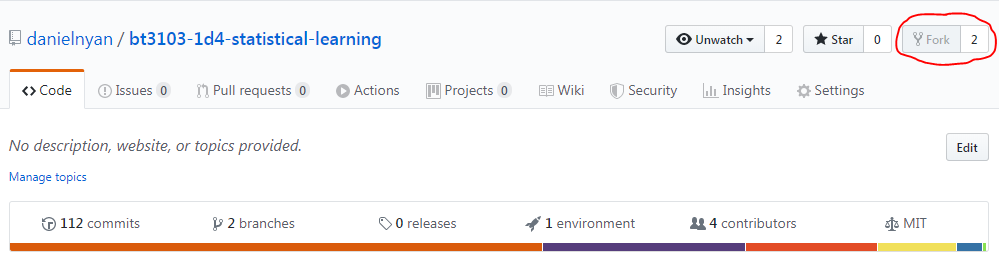
</p>
2. Login into AWS Educate, click **AWS Account**, then click the orange **AWS Starter Account** 
button. You should see this screen. Proceed to click Account Details.
<p align="center">
  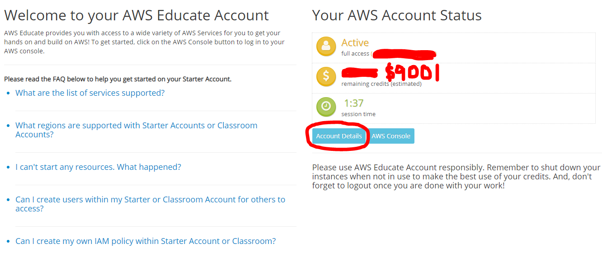
</p>
3. You should see this screen pop up. Click Show
<p align="center">
  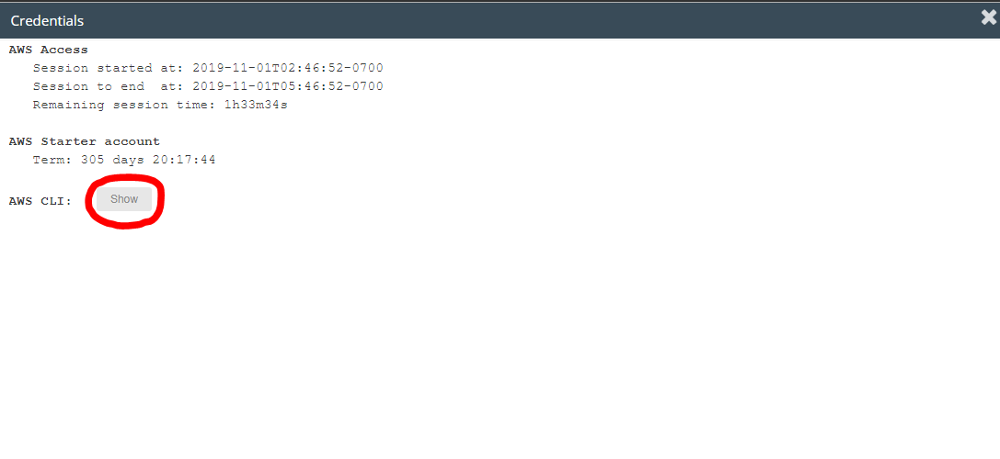
</p>
4. The revealed text would be in the format
```
[default]
aws_access_key_id=MYACCESSKEYID
aws_secret_access_key=thequickbrownfoxjumpsoveralazydog
aws_session_token=reallyLongText
```
Take note of your AWS_ACCESS_KEY_ID (which is MYACCESSKEYID in my case, your access key ID may differ), 
as well as the AWS_SECRET_ACCESS_KEY and AWS_SESSION_TOKEN. We will use them soon.

5. Go back to your forked repository and click on Settings. 
<p align="center">
  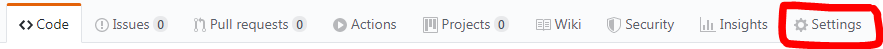
</p>
6. Navigate to Secrets
<p align="center">
  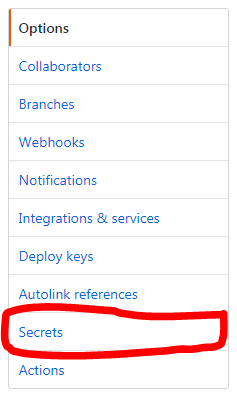
</p>
7. Click on **Add a new secret**. Set the **Name** to AWS_ACCESS_KEY_ID and set the **Value** to 
the value of your access key ID (which is MYACCESSKEYID in my case). Add in two more secrets 
AWS_SECRET_ACCESS_KEY and AWS_SESSION_TOKEN and fill in the values according to what you've recorded 
from Step 4.

8. On AWS Educate, go to AWS Console. 
<p align="center">
  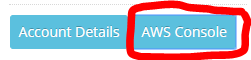
</p>
9. Type in S3 in the searchbar and navigate to S3
<p align="center">
  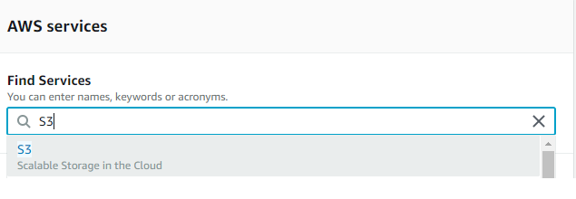
</p>
10. Click on Create Bucket and enter in a valid bucket name. Amazon will tell you if your bucket name is 
invalid. Leave all other options untouched and click Next.
<p align="center">
  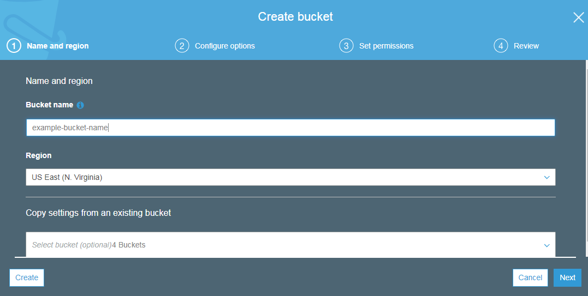
</p>
11. Keep everything at their default values and click Next.
<p align="center">
  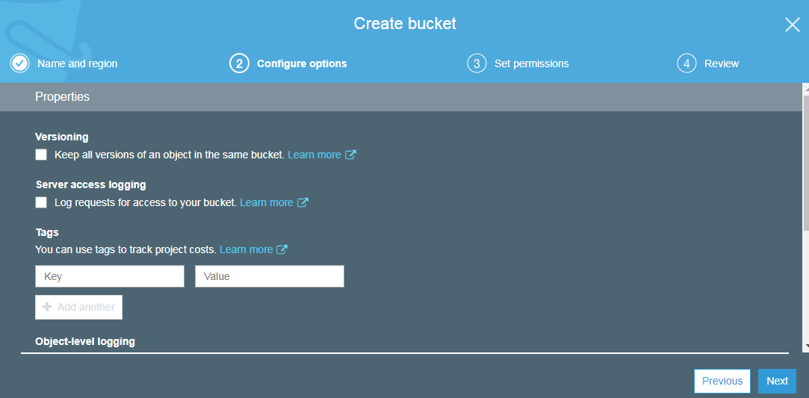
</p>
12. Uncheck all options except for the last one. Your permissions settings should look exactly like 
the example below. Click Next
<p align="center">
  
</p>
13. You should be at the Review tab. Click Next to create your bucket, and go back to your Secrets Tab in GitHub.

14. Add your last key which is BUCKET_NAME and set it to be exactly the name of your S3 bucket that you've 
just created. With reference to step 10, the bucket name we used is example-bucket-name.

15. Make a change in your repository to trigger the Action. You can track the status of the action under the 
Actions tab. 
<p align="center">
  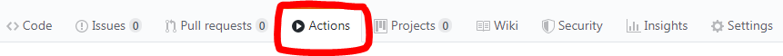
</p>
16. To see your deployed serverless application, go to Lambda
<p align="center">
  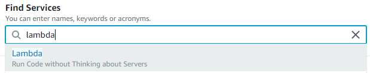
</p>
17. You should see your version of our app deployed as one of your Lambda functions. Click it
<p align="center">
  
</p>
18. Click on **API Gateway** and scroll all the way down. The API endpoint shows the URL of your version 
of the serverless application. Replace {proxy+} with index.html and you're good to go!
<p align="center">
  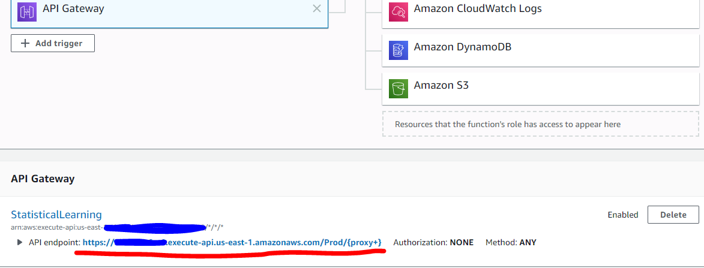
</p>

### Troubleshooting
**Invalid Credentials**  
Assuming that you're using AWS Educate, repeat steps 3 to 8 and replace your AWS_SECRET_ACCESS_KEY, 
AWS_SESSION_TOKEN and AWS_ACCESS_KEY_ID with the new values. Your credentials expire every 3 hours.

**Unable to create stack / ROLLBACK COMPLETE**  
Search for CloudFormation on AWS Console and delete the stack called StatisticalLearning, if it exists. 
Then rerun the checks again. Usually deleting and recreating the stack rectifies the problem.